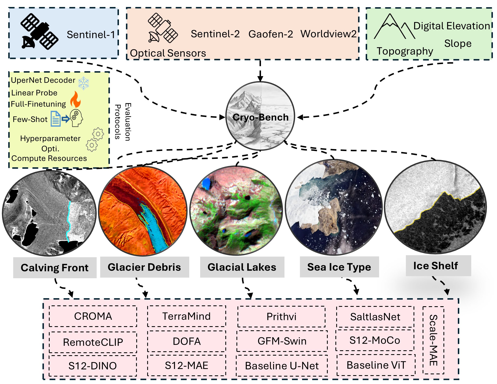
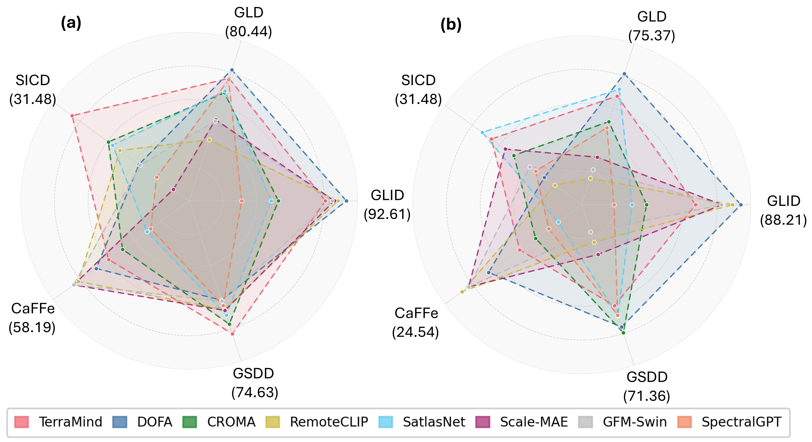

# Cryo-Bench 🧊

> **A Benchmark for Evaluating Geospatial Foundation Models on Cryosphere Applications**

**Cryo-Bench** is a community benchmark that evaluates geospatial foundation models (GFMs) on five cryosphere remote sensing tasks spanning glacial lakes, supraglacial debris, sea ice, and calving fronts. It is built on top of the [PANGAEA](https://arxiv.org/abs/2412.04204) evaluation protocol using multi-sensor satellite imagery from Sentinel-1/2, Landsat-8, WorldView-2, and historical SAR missions.

---

## 📋 Tasks & Datasets

Cryo-Bench includes five benchmark tasks covering key components of the cryosphere:

| Dataset | Component | Location | Sensors | Classes | Ancillary Data | Paper | Download |
|---------|-----------|----------|---------|---------|----------------|-------|----------|
| **GSDD** | Supraglacial Debris | Global | Sentinel-2 | Binary | Slope, Elevation, Velocity | [Article](https://www.sciencedirect.com/science/article/pii/S2666017225001257) | [Zenodo](https://zenodo.org/records/17161810) |
| **GLID** | Glacial Lakes | Himalayas | WorldView-2, Sentinel-2, Landsat-8, Gaofen-2 | Binary | — | [Article](https://www.sciencedirect.com/science/article/pii/S002216942500410X) | [Zenodo](https://zenodo.org/records/14838695) |
| **GLD** | Glacial Lakes | Himalayas | Sentinel-2 | Binary | SAR Coherence, Slope, Elevation | [Article](https://www.sciencedirect.com/science/article/pii/S1569843222002734) | [Zenodo](https://zenodo.org/records/16986936) |
| **SICD** | Sea Ice | Canadian & Greenlandic Arctic | Sentinel-1 | Multiclass | Incidence Angle | [Article](https://egusphere.copernicus.org/preprints/2023/egusphere-2023-2648/) | [HuggingFace](https://huggingface.co/datasets/torchgeo/ai4artic-sea-ice-challenge) |
| **CaFFe** | Calving Fronts | Greenland, Alaska, Antarctic Peninsula | ERS-1/2, Envisat, RADARSAT-1, ALOS PALSAR, TSX, TDX, Sentinel-1 | Multiclass | — | [Article](https://essd.copernicus.org/articles/14/4287/2022/) | [PANGAEA](https://doi.pangaea.de/10.1594/PANGAEA.940950) |

---

## 🏆 Benchmark Results

Table below reports mIoU (↑) for all models evaluated with **frozen encoders** and **100% training data** using the UPerNet decoder. Rank (↓) is averaged across all five tasks. Baseline models (U-Net, ViT) are trained from scratch.

> **Bold** = best performance · *Italic* = second best

| Model | GLID | GLD | SICD | CaFFe | GSDD | Avg. mIoU ↑ | Avg. Rank ↓ |
|-------|:----:|:---:|:----:|:-----:|:----:|:-----------:|:-----------:|
| CROMA | 78.52 | 76.84 | 24.84 | 42.03 | 74.15 | 59.28 | 6.60 |
| DOFA | **92.61** | 80.44 | 19.20 | 50.71 | 72.96 | 63.18 | 6.20 |
| GFM-Swin | 89.68 | 72.42 | 18.98 | 58.13 | 73.00 | 62.44 | 9.40 |
| Prithvi | 71.11 | 75.84 | 20.59 | 32.01 | 70.52 | 54.01 | 13.60 |
| RemoteCLIP | 90.88 | 69.52 | 22.71 | 56.64 | 73.42 | 62.63 | 8.00 |
| SatlasNet | 77.02 | 77.11 | 24.04 | 33.96 | 73.70 | 57.17 | 8.40 |
| Scale-MAE | 90.13 | 72.65 | 12.90 | *58.19* | 73.47 | 61.47 | 8.80 |
| SpectralGPT | 70.87 | 78.90 | 15.98 | 32.70 | 73.22 | 54.33 | 11.80 |
| S12-MoCo | 75.51 | 77.38 | 26.09 | 36.21 | 73.03 | 57.64 | 8.80 |
| S12-DINO | 75.69 | 75.91 | 27.28 | 35.58 | 71.19 | 57.13 | 10.20 |
| S12-MAE | 75.71 | 77.39 | 20.63 | 36.99 | 73.51 | 56.85 | 8.20 |
| S12-Data2Vec | 75.19 | 77.10 | 24.15 | 35.96 | 73.68 | 57.22 | 9.00 |
| TerraMind | 88.26 | 79.10 | 31.48 | 46.64 | 74.63 | *64.02* | *3.40* |
| RAMEN | 82.17 | 73.67 | 16.52 | 25.10 | 70.56 | 57.17 | 12.80 |
| **U-Net** *(baseline)* | *91.58* | 77.51 | *29.11* | 59.82 | 73.89 | **66.38** | **2.80** |
| **ViT** *(baseline)* | 71.58 | **80.18** | 16.17 | 39.90 | **74.41** | 56.45 | 8.00 |

> Encoders are kept **frozen** for all GFMs. U-Net and ViT are trained from scratch.

## 📜 License

This project is licensed under the [MIT License](LICENSE).

---

---

## 🙏 Acknowledgements

Cryo-Bench builds on the [PANGAEA benchmark](https://github.com/yurujaja/pangaea-bench) and the [RAMEN](https://github.com/nicolashoudre/RAMEN) framework. We thank the developers of DOFA, TerraMind, Prithvi, SatlasNet, and all other foundation models included in this benchmark. We also thank the dataset authors of GSDD, GLID, GLD, SICD, and CaFFe for making their data publicly available.
