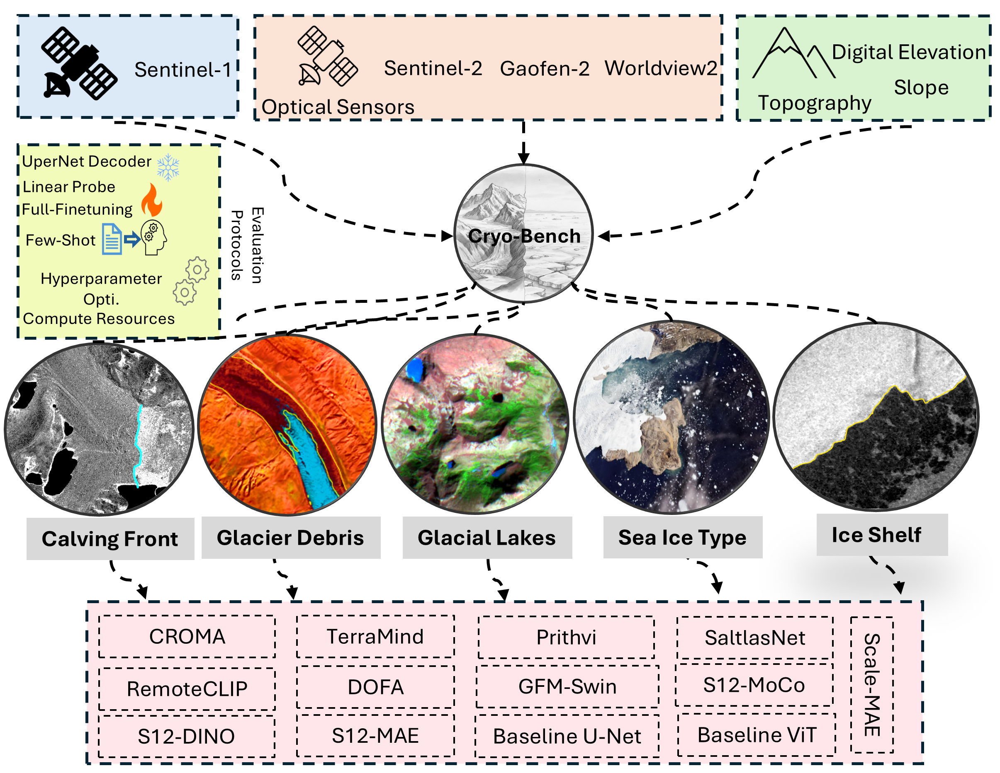

# Cryo-Bench 🧊

> **A Benchmark for Evaluating Geospatial Foundation Models on Cryosphere Applications**

[](https://arxiv.org/abs/2412.04204)
[](https://huggingface.co/datasets/Sk-21/Cryo-Bench)
[](LICENSE)




**Cryo-Bench** is a community benchmark that evaluates geospatial foundation models (GFMs) on six cryosphere segmentation datasets spanning five components: supraglacial debris, glacial lakes (two sensing configurations), sea ice, calving fronts, and Antarctic ice-shelf extent. It is built on top of the [PANGAEA](https://arxiv.org/abs/2412.04204) evaluation protocol using multi-sensor satellite imagery from Sentinel-1/2, Landsat-8, WorldView-2, and historical SAR missions.

---

## 📋 Tasks & Datasets

Cryo-Bench includes six benchmark tasks covering five components of the cryosphere:

| Dataset | Component | Location | Sensors | Classes | Ancillary Data | Paper | Download |
|---------|-----------|----------|---------|---------|----------------|-------|----------|
| **GSDD** | Supraglacial Debris | Global | Sentinel-2 | Binary | Slope, Elevation, Velocity | [Article](https://www.sciencedirect.com/science/article/pii/S2666017225001257) | [Zenodo](https://zenodo.org/records/17161810) |
| **GLID** | Glacial Lakes | Himalayas | WorldView-2, Sentinel-2, Landsat-8, Gaofen-2 | Binary | — | [Article](https://www.sciencedirect.com/science/article/pii/S002216942500410X) | [Zenodo](https://zenodo.org/records/14838695) |
| **GLB** | Glacial Lakes (multi-source) | High Mountain Asia | Sentinel-2, Sentinel-1, terrain (11 bands) | Binary | Slope, Elevation | [Article](https://essd.copernicus.org/preprints/essd-2026-474/) | [Zenodo](https://zenodo.org/records/17917359) |
| **SICD** | Sea Ice | Canadian & Greenlandic Arctic | Sentinel-1 | Multiclass | Incidence Angle | [Article](https://egusphere.copernicus.org/preprints/2023/egusphere-2023-2648/) | [HuggingFace](https://huggingface.co/datasets/torchgeo/ai4artic-sea-ice-challenge) |
| **CaFFe** | Calving Fronts | Greenland, Alaska, Antarctic Peninsula | ERS-1/2, Envisat, RADARSAT-1, ALOS PALSAR, TSX, TDX, Sentinel-1 | Multiclass | — | [Article](https://essd.copernicus.org/articles/14/4287/2022/) | [PANGAEA](https://doi.pangaea.de/10.1594/PANGAEA.940950) |
| **Shelf-Bench** | Ice-Shelf Extent | Antarctica | SAR,  Sentinel-1 | Binary |  | [Article](https://essd.copernicus.org/preprints/essd-2025-758/) | [Zenodo](https://zenodo.org/records/20430768) |

---

## 🚀 Installation & Quick Start

```bash
git clone https://github.com/Sk-2103/Cryo-Bench.git
cd Cryo-Bench
conda env create -f environment.yml
conda activate pangaea-bench
```

Download the dataset(s) you need from the links in the table above and note the local path you
extract them to (`<data_root>`). `pangaea/run.py` is the entry point and takes a Hydra config for
every axis (dataset, encoder, decoder, ...), so a full run looks like this:

```bash
python -m torch.distributed.run --standalone --nproc_per_node=1 pangaea/run.py \
  task=segmentation preprocessing=seg_default criterion=cross_entropy \
  dataset=sicd_rgb encoder=unet_encoder decoder=seg_unet \
  dataset.root_path=<data_root>/SICD work_dir=./work_dir/unet_sicd \
  finetune=true limited_label_train=1
```

That reproduces the U-Net/SICD cell of the table below (27.17 mIoU). A few things to swap out:

- `encoder` is any file under `configs/encoder/`: `dofa`, `terramind_large`, `croma_joint`,
  `vit_scratch`, `unet_encoder`, ... For anything other than the U-Net baseline, use
  `decoder=seg_upernet`.
- `dataset` is any file under `configs/dataset/`: `gssd`, `glid`, `glb_random`, `sicd_sar`,
  `sicd_rgb`, `zone_mapping_sar`, `zone_mapping_optical`, `shelf_bench`.
- `finetune=false` freezes the encoder, the default evaluation regime for every GFM (the two
  from-scratch baselines always need `finetune=true`, since they have no pretrained weights).
  `limited_label_train=0.1` runs the few-shot regime instead of the full training set.

See the paper for the full protocol (crop sizes, learning-rate schedule, normalization per
dataset, evaluation regimes).

---

## 📁 Repository Structure

```
Cryo-Bench/
├── pangaea/            # evaluation framework
│   ├── datasets/       # one module per dataset (gssd, glid, glb, sicd_tiled, zone_mapping_*, shelf_bench)
│   ├── encoders/       # GFM wrappers (CROMA, DOFA, TerraMind, Prithvi, SatlasNet, Scale-MAE, SpectralGPT, SSL4EO-S12, ...) and the U-Net/ViT baselines
│   ├── decoders/       # UPerNet (GFMs) and U-Net (baseline) segmentation heads
│   ├── engine/         # trainer / evaluator
│   └── utils/
├── configs/             # Hydra configs, one subdirectory per axis
│   ├── dataset/         # 8 configs, one per dataset/modality variant
│   ├── encoder/         # 20 configs: 13 GFMs plus dataset-specific modality variants, and 2 baselines
│   ├── decoder/         # seg_unet.yaml, seg_upernet.yaml
│   └── preprocessing/, task/, criterion/, optimizer/, lr_scheduler/
└── assets/              # README images
```

---

## 🏆 Benchmark Results

The table reports mIoU (↑) with **frozen encoders** and **100% training data**, using the UPerNet decoder across all six datasets. Rows are ordered by six-dataset average mIoU. U-Net and ViT are trained from scratch. Avg Rank is the mean of a model's rank (1-15) on each of the six datasets individually, and can read differently from the ordering by Avg mIoU (e.g. DOFA has a better Avg Rank than RemoteCLIP despite a lower Avg mIoU).

> **Bold** = best performance · *Italic* = second best

| Model | GSDD | GLID | GLB | SICD | CaFFe | Shelf-Bench | Avg. mIoU ↑ | Avg Rank ↓ |
|-------|:----:|:---:|:---:|:----:|:-----:|:-----------:|:-----------:|:----------:|
| **U-Net** | 73.89 | *91.58* | **80.46** | *27.17* | **59.82** | 82.97 | **69.31** | 2.67 |
| TerraMind | **74.63** | 88.26 | *79.91* | **33.27** | 46.64 | 84.46 | *67.86* | 3.17 |
| RemoteCLIP | 73.42 | 90.89 | 78.09 | 24.25 | 56.64 | 83.59 | 67.81 | 5.17 |
| DOFA | 72.96 | **92.61** | 79.39 | 20.41 | 50.71 | **87.08** | 67.19 | 4.83 |
| GFM-Swin | 73.00 | 89.69 | 78.42 | 14.17 | 58.12 | *85.63* | 66.50 | 6.33 |
| Scale-MAE | 73.47 | 90.91 | 79.16 | 9.74 | *58.19* | 83.28 | 65.79 | 6.33 |
| CROMA | 74.15 | 78.52 | 77.68 | 21.81 | 42.03 | 81.15 | 62.56 | 6.17 |
| **ViT** | *74.41* | 78.14 | 79.81 | 15.58 | 40.25 | 81.86 | 61.67 | 6.00 |
| S12-MoCo | 73.03 | 75.51 | 75.45 | 19.86 | 36.21 | 74.97 | 59.17 | 10.00 |
| SatlasNet | 73.70 | 77.03 | 74.74 | 19.62 | 33.96 | 73.00 | 58.67 | 10.17 |
| S12-MAE | 73.51 | 75.71 | 75.43 | 12.28 | 36.99 | 75.93 | 58.31 | 9.67 |
| S12-Data2Vec | 73.68 | 75.19 | 74.59 | 11.49 | 35.96 | 75.79 | 57.78 | 11.33 |
| S12-DINO | 71.19 | 75.69 | 75.17 | 12.74 | 35.58 | 75.28 | 57.61 | 11.67 |
| Prithvi | 70.52 | 71.11 | 74.96 | 12.58 | 32.01 | 74.41 | 55.93 | 13.50 |
| SpectralGPT | 73.22 | 70.87 | 72.82 | 14.39 | 32.70 | 66.75 | 55.12 | 13.00 |

With frozen encoders, the from-scratch U-Net comes out on top with a 69.31% six-dataset average,
ahead of TerraMind at 67.86%. Bootstrapping over the test scenes puts the paired difference at
1.45 points with a 95% interval of [+0.94, +1.98], so that lead holds up and isn't just an
artifact of which scenes happen to be in the test split. The picture flips once labels get
scarce: at 10% of the training labels, GFMs retain 92.5% of their full-label accuracy on average
against 86.1% for U-Net, and five of them outright beat the baseline. Letting each model pick its
own fine-tuning learning rate closes most of the rest of the gap, with four GFMs (TerraMind,
GFM-Swin, DOFA, Scale-MAE) edging past U-Net on average. The paper has the full breakdown across
regimes, per-dataset bootstrap intervals, and the label-efficiency and fine-tuning tables.

## 📜 License

This project is licensed under the [MIT License](LICENSE).

---

## 🙏 Acknowledgements

Cryo-Bench builds on the [PANGAEA benchmark](https://github.com/yurujaja/pangaea-bench). We thank the developers of DOFA, TerraMind, Prithvi, SatlasNet, and all other foundation models included in this benchmark. We also thank the dataset authors of GSDD, GLID, GLB, SICD, CaFFe, and Shelf-Bench for making their data publicly available.
